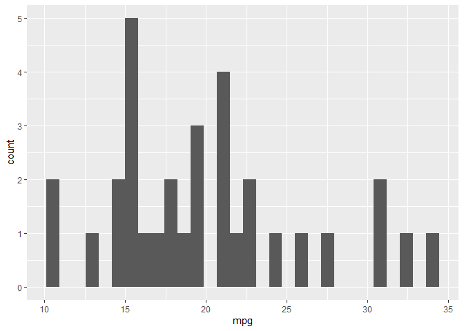

Reporte de prueba
================
B. Adasme
2023-04-17

## Inicio

``` r
library(tidyverse)
```

    ## ── Attaching packages ─────────────────────────────────────── tidyverse 1.3.2 ──
    ## ✔ ggplot2 3.4.0      ✔ purrr   0.3.5 
    ## ✔ tibble  3.1.8      ✔ dplyr   1.0.10
    ## ✔ tidyr   1.2.1      ✔ stringr 1.4.1 
    ## ✔ readr   2.1.3      ✔ forcats 0.5.2 
    ## ── Conflicts ────────────────────────────────────────── tidyverse_conflicts() ──
    ## ✖ dplyr::filter() masks stats::filter()
    ## ✖ dplyr::lag()    masks stats::lag()

``` r
library(janitor)
```

    ## 
    ## Attaching package: 'janitor'
    ## 
    ## The following objects are masked from 'package:stats':
    ## 
    ##     chisq.test, fisher.test

``` r
library(readxlsb)
```

    ## Warning: package 'readxlsb' was built under R version 4.2.3

¿Qué queremos hacer?

``` r
mtcars %>% 
  tabyl(carb) %>% 
  knitr::kable()
```

| carb |   n | percent |
|-----:|----:|--------:|
|    1 |   7 | 0.21875 |
|    2 |  10 | 0.31250 |
|    3 |   3 | 0.09375 |
|    4 |  10 | 0.31250 |
|    6 |   1 | 0.03125 |
|    8 |   1 | 0.03125 |

Bien, esto funciona. Probemos con un gráfico de ggplot

``` r
mtcars %>% 
  ggplot(aes(mpg)) +
  geom_histogram()
```

    ## `stat_bin()` using `bins = 30`. Pick better value with `binwidth`.

<!-- -->
